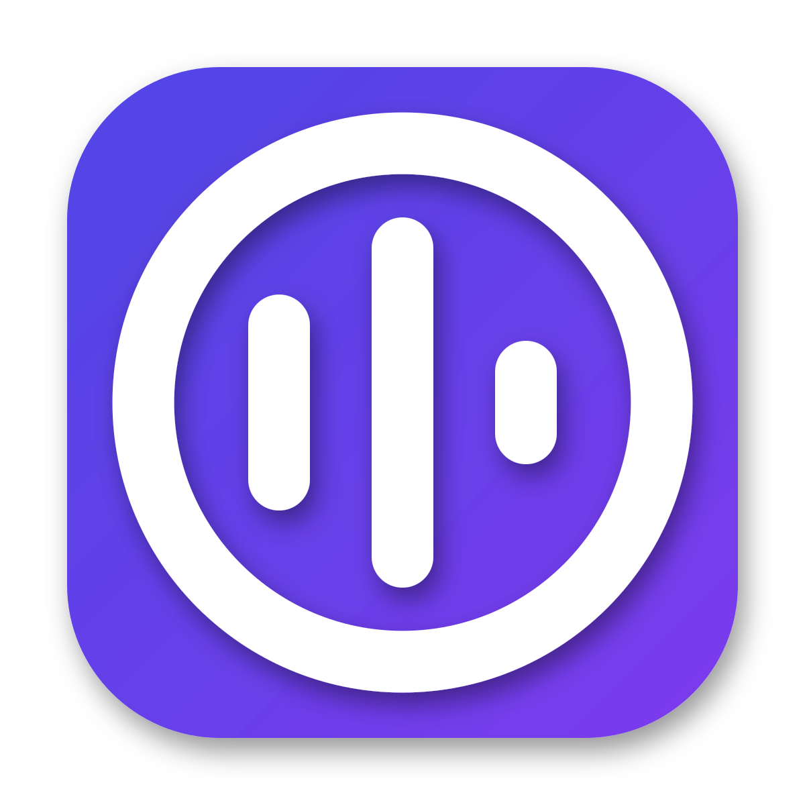

<p align="center">
  
</p>

<h1 align="center">Votype</h1>

<p align="center">
  <strong>A free, open source, and extensible speech-to-text application that works completely offline.</strong>
</p>

<p align="center">
  <a href="https://github.com/zhuzhuyule/Votype/releases"></a>
  <a href="https://github.com/zhuzhuyule/Votype/blob/main/LICENSE"></a>
  <a href="https://github.com/zhuzhuyule/Votype/stargazers"></a>
</p>

<p align="center">
  <a href="#-features">Features</a> •
  <a href="#-quick-start">Quick Start</a> •
  <a href="#%EF%B8%8F-supported-models">Models</a> •
  <a href="#-ai-post-processing">AI Processing</a> •
  <a href="#-contributing">Contributing</a>
</p>

<p align="center">
  <b>Language / 语言:</b>&nbsp;&nbsp;
  <strong>English</strong> |
  <a href="./docs/README_ZH.md">中文</a>
</p>

---

## ✨ Features

### 🎤 Local Speech Recognition

- **100% Offline** - Your voice never leaves your device
- **One GGUF Model Catalog** - 65 models across Whisper, Moonshine, Nemotron, Parakeet, Canary, Cohere, GigaAM, Voxtral, SenseVoice and Fun-ASR, powered by transcribe.cpp
- **Engine-Level Streaming** - True real-time transcription as you speak with streaming models (Nemotron, Moonshine, Voxtral)
- **Auto Language Detection** - Works with Chinese, English, Japanese, Korean, and more
- **Custom Vocabulary** - Add domain-specific terms for better accuracy

### 🔄 Five Transcription Modes

Votype supports multiple transcription modes for different needs:

| Mode                      | Description                                              | Best For                             |
| ------------------------- | -------------------------------------------------------- | ------------------------------------ |
| **🟢 Realtime**           | Engine-level streaming models, text appears as you speak | Instant feedback during conversation |
| **🔵 Simulated Realtime** | Full transcription displayed in batches                  | Accuracy with realtime experience    |
| **🔵 Full Transcription** | Whisper models, transcribe after recording               | High accuracy for formal use         |
| **🌐 Online API**         | Cloud ASR, returns after recording ends                  | Maximum accuracy                     |
| **🟣 Hybrid Mode**        | Realtime preview + Online API final result               | Balance of experience and accuracy   |

> 💡 **Tip**: We recommend **Hybrid Mode** - see preview while speaking, get the most accurate final result.

### 🌐 Online ASR (Optional)

- **Cloud ASR Integration** - Use cloud providers for enhanced accuracy
- **Hybrid Mode** - Combine local + cloud for best results
- **Dual Candidate Mode** - Compare local and online results

### 🤖 AI Post-Processing

- **LLM Enhancement** - Clean, format, and improve transcriptions with AI
- **Multiple Providers** - OpenAI, Anthropic, OpenRouter, Apple Intelligence, or custom endpoints
- **Command Aliases** - Trigger specific prompts with voice commands (e.g., "translate to English")
- **Custom Prompts** - Create your own processing workflows with custom icons

### 🎨 Modern UI/UX

- **Dashboard** - View transcription history with audio playback
- **Processing Chain Badges** - See which models processed each entry
- **Icon Picker** - Choose icons for your custom prompts (40+ built-in + Iconify search)
- **Theme Customization** - Light/Dark mode, accent colors, corner radius
- **16 UI Languages** - English, 中文, 日本語, 한국어, Deutsch, Español, Français, Italiano, Polski, Português, Русский, Українська, Čeština, Türkçe, Tiếng Việt, العربية

### ⚡ Productivity

- **Global Hotkeys** - Trigger transcription from anywhere
- **Push-to-Talk** or Toggle mode
- **Smart Paste** - Direct input, Ctrl+V, or clipboard
- **Recording Overlay** - Visual feedback while recording
- **Audio Feedback** - Customizable start/stop sounds

---

## 🚀 Quick Start

### Installation

#### macOS

1. **Download** from [Releases](https://github.com/zhuzhuyule/Votype/releases)
2. **Install**: Drag `Votype.app` to Applications folder
3. **First Launch** (Important!):

   ```bash
   # Run this command to re-sign after installation
   codesign --force --deep --sign - /Applications/Votype.app

   # Then open normally
   open /Applications/Votype.app
   ```

   > ⚠️ **Why re-signing is needed?**  
   > Votype bundles third-party native libraries (GGML-based ASR engines) with their own code signatures. Re-signing resolves signature conflicts and allows macOS to load these libraries properly.

4. **Grant Permissions** (Required):

   **Microphone Access**
   - Why: To record your voice for transcription
   - When: Prompted on first use
   - Settings: System Settings → Privacy & Security → Microphone → Enable Votype

   **Accessibility Access** (Optional, but recommended)
   - Why: Required for text pasting and cursor positioning features
   - When: Prompted when you first use paste functionality
   - Settings: System Settings → Privacy & Security → Accessibility → Enable Votype
   - Note: App can start without this permission, but paste features will be unavailable

5. **Start Using**:
   - Press hotkey (default: `Option+Space`)
   - Speak and release
   - Your text appears instantly!

#### Windows / Linux

1. Download from [Releases](https://github.com/zhuzhuyule/Votype/releases)
2. Install and grant microphone permission
3. Press hotkey (default: `Ctrl+Space`)

### System Requirements

| Platform    | Requirements                   |
| :---------- | :----------------------------- |
| **macOS**   | 10.13+, Intel or Apple Silicon |
| **Windows** | Windows 10+, x64 or ARM64      |
| **Linux**   | x64, Ubuntu 22.04+ recommended |

---

## 🗣️ Supported Models

### Offline ASR Models (GGUF)

65 models distributed across the following families, all loaded by transcribe.cpp:

| Model Family                  | Languages    | Speed        | Notes                                    |
| :---------------------------- | :----------- | :----------- | :--------------------------------------- |
| **Moonshine**                 | en, zh       | ⚡⚡ Fastest | Tiny/Small/Medium, streaming variants    |
| **Nemotron ASR**              | en           | ⚡ Fast      | Engine-level streaming                   |
| **Whisper**                   | 99 languages | 🔋 Moderate  | Metal acceleration on Apple Silicon      |
| **Parakeet / Canary**         | en           | ⚡ Fast      | High accuracy, includes unified variants |
| **SenseVoice / Fun-ASR**      | zh, en       | ⚡ Fast      | Strong for Chinese                       |
| **Voxtral / GigaAM / Cohere** | Multilingual | 🔋 Moderate  | Realtime & European language coverage    |

### Real-time Features

- **VAD (Voice Activity Detection)** - Silero (vad-rs) and Earshot, switchable at runtime
- **Auto Punctuation** - Add punctuation automatically
- **ITN (Inverse Text Normalization)** - Convert "twenty five" to "25"

---

## 🤖 AI Post-Processing

Transform raw transcriptions into polished text:

### Supported Providers

| Provider           | Notes                        |
| :----------------- | :--------------------------- |
| OpenAI             | GPT-4, GPT-3.5, etc.         |
| Anthropic          | Claude models                |
| OpenRouter         | Access to 100+ models        |
| Apple Intelligence | macOS 15+ Apple Silicon only |
| Custom             | Any OpenAI-compatible API    |

### Command Aliases

Trigger specific prompts by voice:

- Say "translate to English" → Triggers translation prompt
- Say "summarize this" → Triggers summary prompt
- Configurable command prefixes (e.g., "please", "帮我")

### Custom Prompts

Create workflows for:

- 📝 Grammar & spelling correction
- 🌐 Translation
- 📋 Summarization
- 🔄 Format conversion
- Custom icons for each prompt

---

## 🛠 Architecture

Built with modern technologies:

- **Frontend**: React 18, TypeScript, Tailwind CSS v4, Radix UI
- **Backend**: Tauri v2 (Rust), transcribe-cpp (GGUF/ggml), transcribe-rs (ONNX punctuation)
- **Audio**: cpal, rubato, vad-rs (Silero), earshot
- **State**: Zustand, SQLite

---

## 🤝 Contributing

We welcome contributions! See [CONTRIBUTING.md](CONTRIBUTING.md) for guidelines.

```bash
# Clone and setup
git clone https://github.com/zhuzhuyule/Votype.git
cd Votype
bun install

# Development
bun tauri dev

# Build
bun tauri build
```

---

## 🌱 Upstream & Lineage

Votype is a variant of [cjpais/Handy](https://github.com/cjpais/Handy) (MIT) — same roots, different growth.

- **Baseline**: forked in Feb 2025 and mirrored with upstream through **v0.8.2** (2026-03-29).
- **Re-synced (Sep 2026)**: ported the full **v0.8.2 → v0.9.7** upstream capability window in six phases — post-process hardening & language-aware filler removal, real-time-safe audio capture pipeline fixes, receipt-sequenced reliable paste (macOS), Earshot VAD backend & activation state machine (hold-to-talk), engine-level streaming transcription (transcribe.cpp 0.2.3), and the macOS Secure Input guard — followed by a feature-level retrospective audit of the entire v0.4.0–v0.8.2 window.
- **Votype-only capabilities** (not in upstream): OpenAI-compatible local HTTP API server, multi-model comparison, review window, smart routing, and the skill/prompt system.
- Since this sync, upstream and Votype evolve independently; this repository is no longer maintained as a GitHub fork.

---

## 📜 License

MIT License - see [LICENSE](LICENSE) for details.

---

## 🙏 Acknowledgments

- **[cjpais/Handy](https://github.com/cjpais/Handy)** - the upstream project Votype is derived from
- **OpenAI Whisper** - Speech recognition model
- **whisper.cpp & ggml** - Cross-platform inference
- **Moonshine & OpenNemotron** - Fast streaming ASR model families
- **Silero** - Voice Activity Detection
- **Tauri** - Desktop app framework

---

<p align="center">
  <i>"Your search for the right speech-to-text tool can end here—not because Votype is perfect, but because you can make it perfect for you."</i>
</p>
