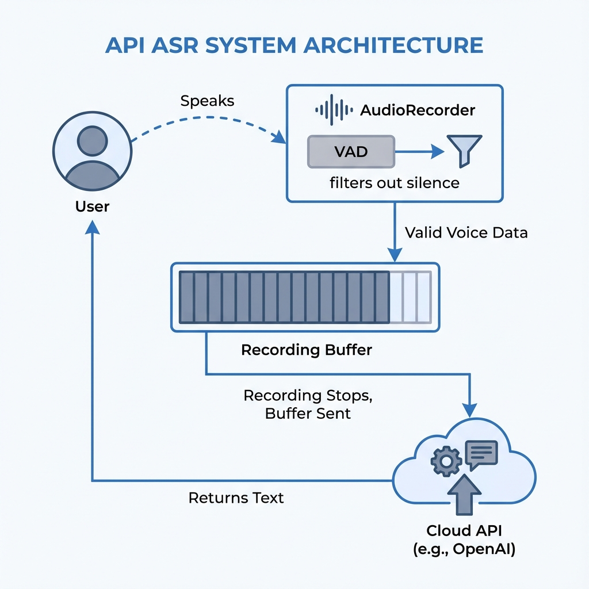
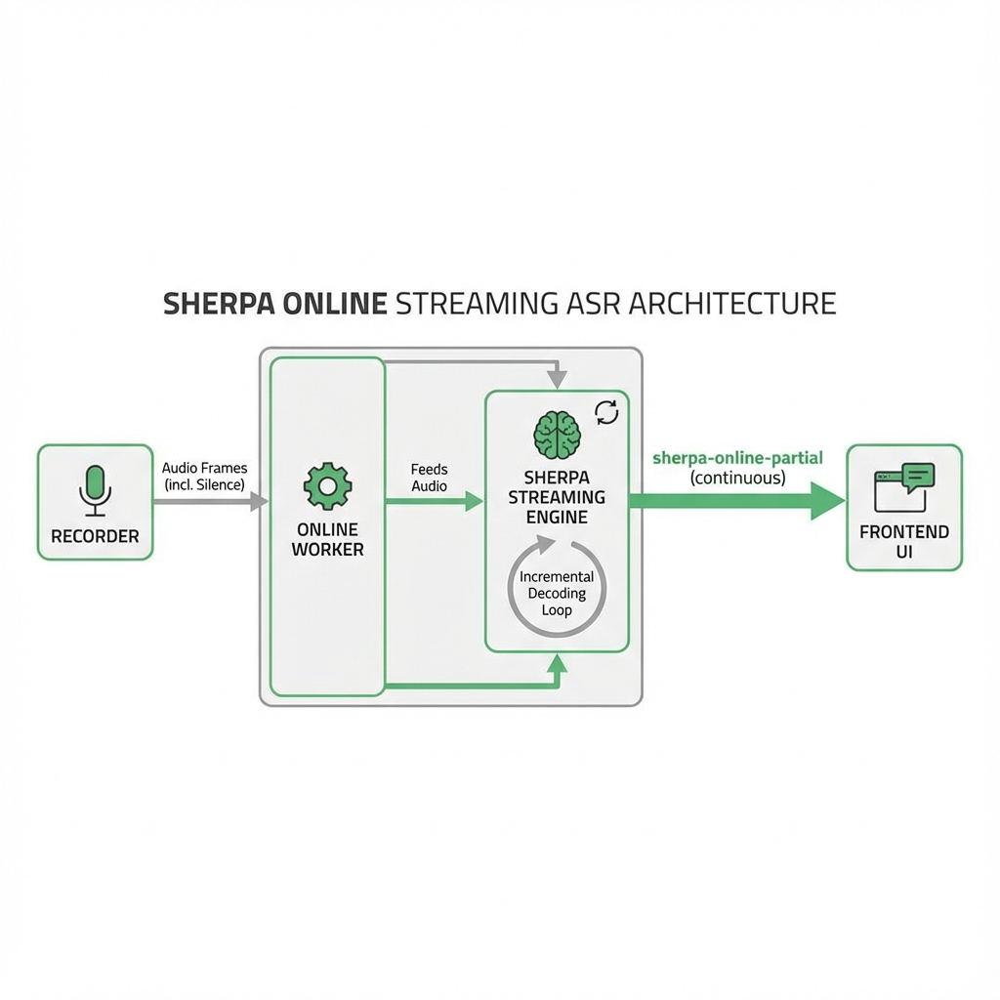
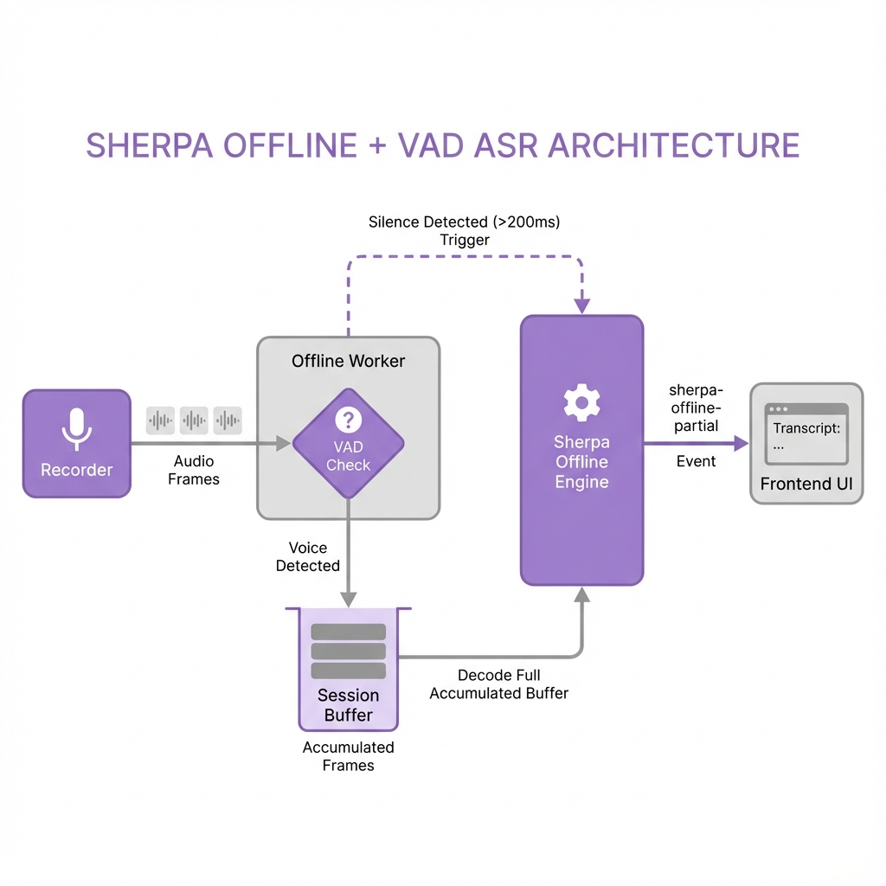

# ASR System Architecture

本文档详细说明了 Handy 中的 ASR（语音识别）系统架构，特别是从录音到转录的核心数据流和控制逻辑。

Handy 支持三种录音/转录模式：

1. **API ASR** (OpenAI, Gemini 等云端服务)
2. **Sherpa Online** (本地流式模型)
3. **Sherpa Offline + VAD** (本地离线模型 + VAD流式)

## 核心架构概览

### 录音与 VAD (Voice Activity Detection)

所有模式的基础都是 `AudioRecorder`，它集成了 VAD 系统。

- **VAD 机制**：VAD 实时分析音频帧，判断是否为人声。
- **录音缓冲** (`out_buf`)：**仅包含人声帧**。静音帧在底层就被丢弃，不会进入最终的录音文件。
- **流式通道** (`speech_frame_tx`)：发送人声帧 + 静音帧（不仅用于维持时序，还用于触发离线模型的静音检测逻辑）。

---

## 模式详情

### 1. API ASR (云端服务)

适用于不需要实时反馈，追求高精度云端模型的场景。



- **特点**：录音过程中无实时反馈，结束后一次性转录。
- **流程**：用户说话 -> VAD 过滤静音 -> 缓冲人声数据 -> 录音结束 -> 发送至云端 -> 返回文本。

---

### 2. Sherpa Online (本地流式)

适用于使用专门的 Sherpa Streaming 模型（如 `zipformer-streaming`）。



- **特点**：真正的流式解码，延迟极低，逐字上屏。
- **流程**：Recorder 发送帧（含静音）-> Online Worker -> 实时喂给 Sherpa Streaming Engine -> 增量解码 -> 持续 emit partial 事件 -> UI 实时显示。

---

### 3. Sherpa Offline + VAD (本地离线+伪流式)

这是为了让高质量的离线模型（如 `sensevoice`, `paraformer`）也能拥有实时反馈体验而设计的模式。



- **核心逻辑**：
  - **累积**：`feed` 阶段只累积音频，不转录。
  - **触发**：当检测到静音（VAD 输出 zero frames）持续超过 200ms 时，认为用户说了一句完整的话。
  - **转录**：立即调用离线模型识别**所有已累积的音频**，获得最佳上下文效果。
  - **反馈**：前端收到 partial 事件，用户感觉像是实时上屏。

---

## 路由决策逻辑

系统如何决定使用哪种模式？逻辑在 `TranscribeAction::start` 中：

```mermaid
graph TD
    A[开始录音] --> B{Settings: Online ASR Enabled?}
    B -- Yes --> C[API ASR 模式]
    B -- No --> D{本地模型类型?}
    D -- Sherpa Streaming --> E[Sherpa Online 模式]
    D -- Sherpa Offline --> F[Sherpa Offline + VAD 模式]
    D -- 其他 (Whisper等) --> C[API ASR 模式 (回退)]
```

## 关键代码位置

- **路由逻辑**: `src-tauri/src/actions/transcribe.rs`
- **Session 管理**: `src-tauri/src/managers/transcription.rs`
  - `start_sherpa_offline_session`
  - `feed_sherpa_offline_session`
  - `check_sherpa_offline_silence`
- **VAD 底层**: `src-tauri/src/audio_toolkit/audio/recorder.rs`
